# FreshlyRooted Market


### [Deployed Link](https://freshly-rooted-market-190d6a54a9aa.herokuapp.com/)

# Contents

<!-- TOC -->

* [FreshlyRooted Market](#freshlyrooted-market)
    * [Deployed Link](#deployed-link)
* [Contents](#contents)
    * [Agile Methodology](#agile-methodology)
        * [Overview](#overview)
        * [MoSCoW Prioritization](#moscow-prioritization)
        * [GitHub Projects](#github-projects)
        * [EPICS](#epics)
        * [User Stories](#user-stories)
            * [Developer Stories](#developer-stories)
            * [Shopper Stories](#shopper-stories)
            * [Site User Stories](#site-user-stories)
            * [Store Owner Stories](#store-owner-stories)
    * [Website Goals and Objectives](#website-goals-and-objectives)
    * [Target Audience](#target-audience)
    * [Wireframes](#wireframes)
    * [Database Schema](#database-schema)
    * [Design Choices](#design-choices)
        * [Typography](#typography)
        * [Colour Scheme](#colour-scheme)
        * [Images](#images)
        * [Responsiveness](#responsiveness)
    * [Security Measures and Protective Design](#security-measures-and-protective-design)
        * [User Authentication](#user-authentication)
        * [Password Management](#password-management)
        * [Form Validation](#form-validation)
        * [Database Security](#database-security)
    * [E-Commerce Business Model](#e-commerce-business-model)
    * [Marketing Strategies](#marketing-strategies)
        * [Search Engine Optimisation](#search-engine-optimisation)
        * [SEO Strategies](#seo-strategies)
        * [Social Media](#social-media)
        * [Newsletter Marketing](#newsletter-marketing)
    * [Features](#features)
        * [Header](#header)
        * [Footer](#footer)
        * [Customer Information](#customer-information)
        * [Contact](#contact)
        * [User Account Pages](#user-account-pages)
            * [Signup Page](#signup-page)
            * [Log In Page](#log-in-page)
            * [Log Out Page](#log-out-page)
        * [Profile Page](#profile-page)
            * [Account Information](#account-information)
            * [Order History](#order-history)
            * [User Favorites](#user-favorites)
            * [Account Security](#account-security)
        * [All Products](#all-products)
        * [Product Details](#product-details)
        * [Reviews](#reviews)
        * [Search Results](#search-results)
        * [Special Offers](#special-offers)
        * [Shopping Cart](#shopping-cart)
        * [Checkout](#checkout)
        * [Order Confirmation](#order-confirmation)
        * [Product Management](#product-management)
            * [Dashboard](#dashboard)
            * [Products](#products)
            * [Categories](#categories)
            * [Orders](#orders)
        * [Custom Error Pages](#custom-error-pages)
    * [Django Admin Portal](#django-admin-portal)
        * [Future Features](#future-features)
    * [Deployment](#deployment)
        * [AWS Cloud Service](#aws-cloud-service)
            * [Create and Configure an S3 Bucket](#create-and-configure-an-s3-bucket)
            * [Configure IAM (Identity and Access Management)](#configure-iam-identity-and-access-management)
            * [Final AWS Setup and Heroku Integration](#final-aws-setup-and-heroku-integration)
        * [Stripe](#stripe)
            * [Steps for Stripe Integration](#steps-for-stripe-integration)
            * [Testing Stripe Payments](#testing-stripe-payments)
        * [GMAIL](#gmail)
            * [Steps for Gmail Integration](#steps-for-gmail-integration)
            * [Security and Compliance](#security-and-compliance)
        * [Deployment Process with Heroku](#deployment-process-with-heroku)
        * [To fork the project](#to-fork-the-project)
        * [To clone the project](#to-clone-the-project)
    * [Testing](#testing)
    * [Technology](#technology)
        * [Languages](#languages)
        * [Frameworks](#frameworks)
        * [Python Libraries](#python-libraries)
        * [Programs](#programs)
        * [Payment Service](#payment-service)
        * [Cloud Storage](#cloud-storage)
    * [Credits](#credits)
    * [Disclaimer](#disclaimer)

<!-- TOC -->

## Agile Methodology

### Overview

Agile methodology is a project management approach centered on adaptability, collaboration, and consistent progress
toward well-defined goals. It’s particularly effective in software development, where requirements and solutions evolve
through the combined efforts of self-organizing, cross-functional teams. Agile emphasizes delivering frequent,
incremental updates that improve quality and enable rapid response to changing needs.

[Back to Top](#contents)

### MoSCoW Prioritization

The MoSCoW prioritization technique is a framework used to evaluate the importance of various project features and
tasks. It organizes items into four categories: Must Have, Should Have, Could Have, and Won't Have. This method supports
efficient time management by ensuring that the most critical features are prioritized and completed before others.

[Back to Top](#contents)

### GitHub Projects

GitHub Projects offers a structured approach to task management and progress tracking through project boards. Each board
represents an EPIC, with columns reflecting task statuses like To Do, In Progress, On Hold, Done, and Bugs. Tasks are
systematically organized using labels to indicate the assigned user, priority level, and associated sprint, enabling
efficient team collaboration and streamlined project oversight.


[Link to Kanban Board](https://github.com/users/barkode/projects/8/views/1)

[Back to Top](#contents)

### EPICS

An Epic is a large segment of work broken down into smaller user stories. In this project, each Epic represents a
significant component of the platform's development, ensuring all necessary functionalities are fully covered.

- [EPIC 1: Application Design, Architecture, and Agile Development Setup](https://github.com/barkode/FreshlyRooted-grocery-market-ci/issues/1)
- [EPIC 2: Initial Project Setup, Cloud Integration, and Early Deployment](https://github.com/barkode/FreshlyRooted-grocery-market-ci/issues/2)
- [EPIC 3: Viewing and Navigation](https://github.com/barkode/FreshlyRooted-grocery-market-ci/issues/3)
- [EPIC 4: Registration and User Accounts](https://github.com/barkode/FreshlyRooted-grocery-market-ci/issues/4)
- [EPIC 5: Sorting and Searching](https://github.com/barkode/FreshlyRooted-grocery-market-ci/issues/5)
- [EPIC 6: Purchasing and Checkout](https://github.com/barkode/FreshlyRooted-grocery-market-ci/issues/6)
- [EPIC 7: Admin and Store Management](https://github.com/barkode/FreshlyRooted-grocery-market-ci/issues/7)
- [EPIC 8: User Notifications and Support](https://github.com/barkode/FreshlyRooted-grocery-market-ci/issues/8)
- [EPIC 9: Promotions and Discounts](https://github.com/barkode/FreshlyRooted-grocery-market-ci/issues/9)
- [EPIC 10: Wishlist and Favorites](https://github.com/barkode/FreshlyRooted-grocery-market-ci/issues/10)
- [EPIC 11: SEO & Marketing](https://github.com/barkode/FreshlyRooted-grocery-market-ci/issues/76)
- [EPIC 12: User Experience Optimization](https://github.com/barkode/FreshlyRooted-grocery-market-ci/issues/77)
- [EPIC 13: Quality Assurance and Documentation](https://github.com/barkode/FreshlyRooted-grocery-market-ci/issues/78)
- [EPIC 14 : Error Handling and Custom Error Pages](https://github.com/barkode/FreshlyRooted-grocery-market-ci/issues/82)

[Back to Top](#contents)

---

### User Stories

This project aims to create a robust, user-friendly platform that caters to both visitors and registered users,
prioritizing a seamless experience. The platform will facilitate content creation and management, showcase developer
profiles, and enable interactive opportunities. The following user stories capture the core functionalities and their
purpose, guiding the development toward a user-centered solution.

[Back to Top](#contents)

#### Developer Stories

- [#11](https://github.com/barkode/FreshlyRooted-grocery-market-ci/issues/11) - As a **developer**, I want **to create
  layouts** so that I can **visually represent the view and structure of the application**.

- [#12](https://github.com/barkode/FreshlyRooted-grocery-market-ci/issues/12) - As a **developer**, I want to **adopt
  Agile methodology** so that I can **deliver a high-quality product that aligns with user needs**.

- [#13](https://github.com/barkode/FreshlyRooted-grocery-market-ci/issues/13) - As a **developer**, I want to be able to
  **create visually engaging and responsive designs** so that users can **easily navigate the website and access
  relevant information**.

- [#14](https://github.com/barkode/FreshlyRooted-grocery-market-ci/issues/14) - As a **developer**, I want to be able to
  design an efficient database schema so than I can **store and manage platform content, ensuring optimal performance,
  scalability, and flexibility**.

- [#15](https://github.com/barkode/FreshlyRooted-grocery-market-ci/issues/15) - As a **developer**, I want to be able to
  **set up and configure Django** so that I can **create a functioning application**.

- [#16](https://github.com/barkode/FreshlyRooted-grocery-market-ci/issues/16) - As a **developer**, I want to be able to
  **deploy the Django app to Heroku** so that I can **verify the initial setup is functional**.

- [#17](https://github.com/barkode/FreshlyRooted-grocery-market-ci/issues/17) - As a **developer**, I want to be able to
  **deploy the Django app to Heroku** so that I can **verify the initial setup is functional**.

- [#59](https://github.com/barkode/FreshlyRooted-grocery-market-ci/issues/59) - As a **Developer**, I want to be able to
  **improve the website's search engine optimization (SEO)** so that **it ranks higher in search engine results and
  attracts more organic traffic**.

- [#61](https://github.com/barkode/FreshlyRooted-grocery-market-ci/issues/61) - As a **Developer**, I want **the
  platform to load quickly and respond quickly to user interactions** so that users can **ensure a flawless experience
  **.

- [#65](https://github.com/barkode/FreshlyRooted-grocery-market-ci/issues/65) - As a **Developer**, I want to be able to
  **improve the website's search engine optimization (SEO)** so that **it ranks higher in search engine results and
  attracts more organic traffic**.

- [#66](https://github.com/barkode/FreshlyRooted-grocery-market-ci/issues/66) - As a **Developer**, I **strive to
  maintain thorough documentation** so that I can **facilitate seamless future code maintenance**.

- [#67](https://github.com/barkode/FreshlyRooted-grocery-market-ci/issues/67) - As a **Developer**, I want to be able to
  **deploy the application to Heroku** so **that it is accessible to users online**.

- [#68](https://github.com/barkode/FreshlyRooted-grocery-market-ci/issues/68) - As a **Developer**, I want to **ensure
  that the application meets performance and accessibility standards** so that it **provides a seamless experience for
  all users and performs optimally**.

- [#69](https://github.com/barkode/FreshlyRooted-grocery-market-ci/issues/69) - As a **Developer**, I want to **ensure
  that user stories are thoroughly tested** so that they **meet acceptance criteria and deliver the expected
  functionality**.

[Back to Top](#contents)

#### Shopper Stories

- [#18](https://github.com/barkode/FreshlyRooted-grocery-market-ci/issues/18) - As a **Shopper**, I want to be able to *
  *view a list of products** so that I can **select some to purchase**.
- [#19](https://github.com/barkode/FreshlyRooted-grocery-market-ci/issues/19) - As a **Shopper**, I want to be able to *
  *view a specific category of products** so that I can **quickly find products I’m interested in**.
- [#20](https://github.com/barkode/FreshlyRooted-grocery-market-ci/issues/20) - As a **Shopper**, I want to be able to *
  *view individual product details** so that I can **identify the price, description, rating, image, and available sizes
  **.
- [#21](https://github.com/barkode/FreshlyRooted-grocery-market-ci/issues/21) - As a **Shopper**, I want to be able to *
  *quickly identify deals, clearance items, and special offers** so that I can **take advantage of savings**.
- [#22](https://github.com/barkode/FreshlyRooted-grocery-market-ci/issues/22) - As a **Shopper**, I want to be able to *
  *easily view the total of my purchases at any time** so that I can **avoid overspending**.
- [#23](https://github.com/barkode/FreshlyRooted-grocery-market-ci/issues/23) - As a **Shopper**, I want to be able to *
  *view related products or suggestions for each product I view** so that I can **discover similar items**.
- [#30](https://github.com/barkode/FreshlyRooted-grocery-market-ci/issues/30) - As a **Shopper**, I want to be able to *
  *sort products to easily** so that I can **identify the best-rated, best-priced, and category-specific items**.
- [#31](https://github.com/barkode/FreshlyRooted-grocery-market-ci/issues/31) - As a **Shopper**, I want to be able to *
  *sort a specific category of products** so that I can to **quickly find the best-rated or best-priced items**.
- [#32](https://github.com/barkode/FreshlyRooted-grocery-market-ci/issues/32) - As a **Shopper**, I want to be able to *
  *sort multiple categories simultaneously** so that i can **see the best-rated or best-priced items across broader
  categories**.
- [#33](https://github.com/barkode/FreshlyRooted-grocery-market-ci/issues/33) - As a **Shopper**, I want to be able to *
  *search for products by name or description** so that I can **find a specific item easily**.
- [#34](https://github.com/barkode/FreshlyRooted-grocery-market-ci/issues/) - As a **Shopper**, I want to be able to *
  *see my search term and the number of results**  so thant I can **know if the product I want is available**.
- [#35](https://github.com/barkode/FreshlyRooted-grocery-market-ci/issues/35) - As a **Shopper**, I want to be able to *
  *filter products based on price range and availability** so that I can **find items within my budget that are in stock
  **.
- [#70](https://github.com/barkode/FreshlyRooted-grocery-market-ci/issues/70) - As a **Shopper**, I want to **select the
  size and quantity when purchasing** so that I can **ensure accuracy**.
- [#71](https://github.com/barkode/FreshlyRooted-grocery-market-ci/issues/71) - As a **Shopper**, I want to be able to *
  *view items in my shopping bag** so that I can **confirm total cost and contents**.
- [#72](https://github.com/barkode/FreshlyRooted-grocery-market-ci/issues/72) - As a **Shopper**, I want to be able to *
  *adjust the quantity of items in my bag easily before checkout** so that I can **add or delete from my bag**.
- [#73](https://github.com/barkode/FreshlyRooted-grocery-market-ci/issues/73) - As a **Shopper**, I want to be able to *
  *enter payment information quickly** so that I can **check out without hassle**.
- [#74](https://github.com/barkode/FreshlyRooted-grocery-market-ci/issues/74) - As a **Shopper**, I want to be able to *
  *feel my personal and payment information is safe and secure** so that I can **add my personal information securely**.
- [#75](https://github.com/barkode/FreshlyRooted-grocery-market-ci/issues/75) - As a **Shopper**, I want to be able to *
  *view order confirmation after checkout** so that I can **verify my order before purchase**.
- [#36](https://github.com/barkode/FreshlyRooted-grocery-market-ci/issues/36) - As a **Shopper**, I want to be able to
  have an **option to apply promotional codes during checkout** so that I can **avail discounts**.
- [#37](https://github.com/barkode/FreshlyRooted-grocery-market-ci/issues/37) - As a **Shopper**, I want to be able to *
  *see an estimated delivery date before completing the purchase** so that I **know when to expect my order**.
- [#43](https://github.com/barkode/FreshlyRooted-grocery-market-ci/issues/43) - As a **Shopper**, I want to be able to *
  *access customer support or live chat** so that I can **quickly resolve any issues with my purchase or account**.
- [#44](https://github.com/barkode/FreshlyRooted-grocery-market-ci/issues/44) - As a **Shopper**, I want to be able to *
  *receive push notifications for order status updates** so that I can **stay informed about my delivery**.
- [#45](https://github.com/barkode/FreshlyRooted-grocery-market-ci/issues/45) - As a **Shopper**, I want to be able to *
  *receive emails for special offers, new product arrivals, and upcoming sales** so that I can **stay updated on
  promotions**.
- [#46](https://github.com/barkode/FreshlyRooted-grocery-market-ci/issues/46) - As a **Shopper**, I want to be able to *
  *receive an email notification if there is an issue with my order** so that I can **be informed immediately**.
- [#47](https://github.com/barkode/FreshlyRooted-grocery-market-ci/issues/47) - As a **Shopper**, I want to be able to *
  *see seasonal promotions on the homepage** so that I can **take advantage of timely discounts**.
- [#48](https://github.com/barkode/FreshlyRooted-grocery-market-ci/issues/48) - As a **Shopper**, I want to be able to *
  *apply discount codes during checkout** so that I can **receive discounts on my purchases**.
- [#49](https://github.com/barkode/FreshlyRooted-grocery-market-ci/issues/49) - As a **Shopper**, I want to be able to *
  *notified of limited-time discounts** so that I **don’t miss out on sales**.
- [#51](https://github.com/barkode/FreshlyRooted-grocery-market-ci/issues/51) - As a **Shopper**, I want to be able to *
  *see the discounted price clearly on each product listing** so that I can **know the exact savings**.
- [#53](https://github.com/barkode/FreshlyRooted-grocery-market-ci/issues/53) - As a **Shopper**, I want to be able to *
  *mark items as "Favorites" on the product listing page** so that I can **easily save them for later**.
- [#54](https://github.com/barkode/FreshlyRooted-grocery-market-ci/issues/54) - As a **Shopper**, I want to be able to *
  *add items to my favorites from the product detail page** so that I can **save specific products after viewing them in
  detail**.
- [#55](https://github.com/barkode/FreshlyRooted-grocery-market-ci/issues/55) - As a **Shopper**, I want to be able to *
  *access a Favorites page so that shows all of my saved items** so that I can **view them in one place**.
- [#56](https://github.com/barkode/FreshlyRooted-grocery-market-ci/issues/56) - As a **Shopper**, I want to be able to *
  *remove items from my favorites** so that I can **manage the list and only keep items I’m interested in**.
- [#57](https://github.com/barkode/FreshlyRooted-grocery-market-ci/issues/57) - As a **Shopper**, I want **my favorites
  list to be saved to my user account** so that I can **access it across multiple devices**.
- [#79](https://github.com/barkode/FreshlyRooted-grocery-market-ci/issues/79) - As a **Shopper**, I want be able to *
  *see a user-friendly 404 error page when a page is not found**, so that I **understand the page doesn’t exist and can
  easily navigate back to the main site**.
- [#80](https://github.com/barkode/FreshlyRooted-grocery-market-ci/issues/80) - As a **Shopper**, I want to be able to *
  *see a custom 403 error page if I attempt to access a restricted area** so that **I understand why I cannot access the
  page and can be redirected to relevant areas**.
- [#81](https://github.com/barkode/FreshlyRooted-grocery-market-ci/issues/81) - As a As a **Shopper**, I want to be able
  to **see a custom 500 error page when there is a server error** so that **I know the issue is on the site and not on
  my end, with steps on what to do next**.

[Back to Top](#contents)

#### Site User Stories

- [#24](https://github.com/barkode/FreshlyRooted-grocery-market-ci/issues/24) - As a **Site User**, I want to be able to
  **easily register for an account** so that I can **have a personal account and view my profile**.
- [#25](https://github.com/barkode/FreshlyRooted-grocery-market-ci/issues/25) - As a **Site User**, I want to be able to
  **easily log in or out** so that I can **access my personal account information**.
- [#26](https://github.com/barkode/FreshlyRooted-grocery-market-ci/issues/26) - As a **Site User**, I want to be able to
  **easily recover my password if I forget it** so that I can **regain access to my account**.
- [#27](https://github.com/barkode/FreshlyRooted-grocery-market-ci/issues/27) - As a **Site User**, I want to be able to
  **receive an email confirmation after registering** so that I can **verify my account registration**.
- [#28](https://github.com/barkode/FreshlyRooted-grocery-market-ci/issues/28) - As a **Site User**, I want to be able to
  a **personalized profile** where I can **view my order history, confirmations, and save payment information**.
- [#29](https://github.com/barkode/FreshlyRooted-grocery-market-ci/issues/29) - As a **Site User**, I want to be able to
  **update my account details like address, email, and phone number**, so that I can **keep my account information
  accurate**.
- [#60](https://github.com/barkode/FreshlyRooted-grocery-market-ci/issues/60) - As a **Site User**, I want to be able to
  **subscribe to a newsletter** so that I can **receive updates, promotions, and valuable content directly to my inbox
  **.
- [#62](https://github.com/barkode/FreshlyRooted-grocery-market-ci/issues/62) - As a **Site User**, I want **the
  accessibility features to be improved** so that **all users, including those with disabilities, have equal access and
  usability on the site**.
- [#63](https://github.com/barkode/FreshlyRooted-grocery-market-ci/issues/63) - As a **Site User**, I want to be able to
  **see the visual elements across the platform to be uniform** so that I can **enjoy a cohesive and pleasant user
  interface experience**.
- [#64](https://github.com/barkode/FreshlyRooted-grocery-market-ci/issues/64) - As a **Site User**, I want to be able to
  **navigate the platform smoothly** so that I can **intuitively locate relevant sections and features**.

[Back to Top](#contents)

#### Store Owner Stories

- [#38](https://github.com/barkode/FreshlyRooted-grocery-market-ci/issues/38) - As a **Store Owner**, I want to be able
  to **add new products to the store** so that I can **keep my inventory updated**.

- [#39](https://github.com/barkode/FreshlyRooted-grocery-market-ci/issues/39) - As a **Store Owner**, I want to be able
  to **edit/update products** so that I can **change prices, descriptions, or images**.

- [#40](https://github.com/barkode/FreshlyRooted-grocery-market-ci/issues/40) - As a **Store Owner**, I want to be able
  to **delete products** so that i can **remove items no longer for sale**.

- [#41](https://github.com/barkode/FreshlyRooted-grocery-market-ci/issues/41) - As a **Store Owner**, I want to be able
  to **view basic analytics (e.g., sales trends, popular products)** so that I can **make informed decisions**.

- [#42](https://github.com/barkode/FreshlyRooted-grocery-market-ci/issues/42) - As a **Store Owner**, I want to be able
  to **manage user reviews and moderate inappropriate content** so that I can **maintain a professional and
  user-friendly store**.

- [#50](https://github.com/barkode/FreshlyRooted-grocery-market-ci/issues/50) - As a **Store Owner**, I want to be able
  to **create and manage promotional codes** so that I can **offer discounts to attract customers**.

- [#52](https://github.com/barkode/FreshlyRooted-grocery-market-ci/issues/52) - As a **Store Owner**, I want to be able
  to **manage the duration of each discount** so that **promotions are only active for specified times**.

[Back to Top](#contents)

---

## Website Goals and Objectives

- **Enhance User Experience:**
    - Design a user-friendly interface that is intuitive, visually appealing, and easy to navigate.
    - Ensure the platform is fully responsive and accessible on all devices, including desktops, tablets, and
      smartphones.
- **Facilitate Developer Showcase:**
    - Enable registered users to create, edit, and manage posts and comments easily.
    - Introduce features that promote user engagement, such as the ability to like, favorite, and share content.
- **Optimize Performance and Accessibility:**
    - Fine-tune the platform for fast loading times and quick responses to user actions.
    - Adhere to accessibility standards to ensure an inclusive experience for all users.
- **Support Continuous Improvement and Scalability:**
    - Employ Agile development methodologies to deliver high-quality features and updates continuously.
    - Architect the database and infrastructure to efficiently handle increased traffic and user growth.
- **Ensure Security and Reliability:**
    - Implement strong authentication and authorization protocols to protect user data.
    - Conduct regular code validation and security testing to maintain a stable, secure application.
- **Streamline Payment and Checkout:**
    - Develop a smooth and secure payment process to enhance the checkout experience.
    - Provide multiple payment options and ensure compliance with payment security standards.
- **Encourage Community Engagement and Feedback:**
    - Create channels for users to provide feedback, report issues, and suggest enhancements.
    - Actively respond to user feedback and integrate improvements to continually refine the platform.

[Back to Top](#contents)

## Target Audience

[Our online healthy food grocery market](https://freshly-rooted-market-190d6a54a9aa.herokuapp.com/) is designed for
individuals and families who prioritize wellness,
sustainability, and the convenience of wholesome eating. Our target audience includes:

**Health-Conscious Shoppers** - People who seek nutrient-dense, organic, and minimally processed foods that support a
balanced lifestyle, including those with dietary needs or preferences, such as gluten-free, vegan, or keto options.

**Busy Professionals and Families** - Those who value the convenience of having fresh, high-quality groceries delivered
to their doorsteps, saving time on meal prep and grocery shopping without compromising on health.

**Environmentally Minded Consumers** - Shoppers committed to sustainable living who prefer locally sourced, eco-friendly
packaged foods and are mindful of their environmental impact.

**Fitness and Wellness Enthusiasts** - Athletes, fitness enthusiasts, and individuals focused on nutrition who seek
products that support an active lifestyle and contribute to peak physical performance.

**Parents and Caregivers** - Families looking for organic and clean foods to provide healthy meal options for children
and loved ones, emphasizing nutrition, taste, and ingredient transparency.

**Foodies Seeking Quality Ingredients** - Home cooks and culinary enthusiasts who value premium ingredients and enjoy
exploring fresh, unique, and high-quality foods to enhance their cooking experience.

[Back to Top](#contents)

## Wireframes

The platform's wireframes offer a visual blueprint of the application's layout and structure, detailing the positioning
of essential elements like navigation menus, user profiles, content sections, and interactive features. They serve as a
foundation for creating a cohesive and user-friendly interface, guiding both the design and development stages.
Following thorough testing, some adjustments were made, resulting in minor deviations from the initial wireframes in the
live version of the platform to enhance usability and functionality.

<details>
<summary>Desktop warframes</summary>


</details>

<br/>

<details>
<summary>Mobile warframes</summary>


</details>


[Back to top](#contents)

## Database Schema

The database schema outlines the structure and relationships between key tables for the platform.

This schema was generated using [lucid.app](https://lucid.app/).

<details>
<summary>Start database diagram</summary>

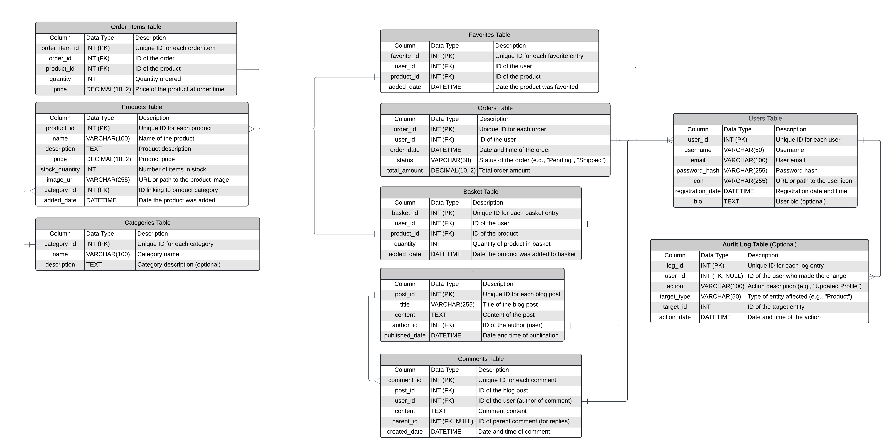

</details>

<details>
<summary>Finish database diagram</summary>


</details>

[Back to top](#contents)

## Design Choices

### Typography

Overview
Lato is a sans-serif typeface family designed by Warsaw-based designer Łukasz Dziedzic in 2010. The name "Lato" means "
Summer" in Polish.
Lato has become one of the most popular web fonts due to its excellent balance of professionalism and approachability,
making it suitable for a wide range of design projects.

[Back to top](#contents)

### Colour Scheme

[A site for inspiration](https://piktochart.com/blog/green-color-palette-combinations/)


[Back to top](#contents)

### Images

Our visual content comes from two primary sources:
**Leonardo AI**

- All images generated through Leonardo AI are provided under permissive free licenses
- These images can be legally used in commercial projects
- No attribution requirements
- Full compliance with copyright regulations
  **Amazon**
- Product images sourced from Amazon's platform
- Used for reference and demonstration purposes only
- Non-commercial usage
- No revenue generation from these images
  This combination of sources ensures legal compliance while maintaining high-quality visual content throughout our
  platform.

[Back to top](#contents)

### Responsiveness

My website is designed to be responsive, adapting smoothly to different screen sizes and device types. This is achieved
through the use of CSS media queries with Bootstrap's breakpoints, ensuring an optimal user experience on all devices.

| Breakpoint        | Class | Dimensions |
|-------------------|-------|------------|
| X-Small           | None  | < 576px    |
| Small             | sm    | ≥ 576px    |
| Medium            | md    | ≥ 768px    |
| Large             | lg    | ≥ 992px    |
| Extra Large       | xl    | ≥ 1200px   |
| Extra extra Large | xxl   | ≥ 1400px   |

[Back to top](#contents)

## Security Measures and Protective Design

### User Authentication

User authentication is a critical component of web applications, ensuring that users can securely access their accounts
and data. It involves verifying the identity of a user through various means, such as passwords, tokens, or third-party
services.
Allauth is a popular Django package that simplifies the implementation of user authentication. It provides a
comprehensive suite of features, including:

- Social Authentication: Allows users to log in using their social media accounts, such as Facebook, Google, or Twitter.
- Email Verification: Ensures that users verify their email addresses before gaining full access to the application.
- Account Management: Offers tools for password reset, account confirmation, and user profile management.
  Allauth is highly customizable, making it easy to integrate with existing Django projects and tailor the
  authentication
  process to specific needs.

[Back to top](#contents)

### Password Management

Django Allauth is a versatile authentication library that not only handles user authentication but also provides
comprehensive password management features. These features are designed to enhance security and improve user experience:

- Password Reset: Allauth includes a built-in password reset mechanism. Users can request a password reset link, which
  is sent to their registered email address. This link allows them to securely set a new password.
- Password Change: Authenticated users can change their passwords directly from their account settings. This feature
  ensures that users can update their credentials regularly to maintain security.
- Password Strength Validation: Allauth can be configured to enforce password strength policies. This includes setting
  minimum length requirements and ensuring the use of a mix of characters to create strong passwords.
- Email Verification: Before allowing password changes or resets, Allauth can require users to verify their email
  addresses. This adds an extra layer of security by ensuring that only legitimate users can modify their credentials.
- Customizable Templates: Allauth provides customizable email templates for password reset and change notifications.
  This allows developers to tailor the communication to fit the branding and tone of their application.
  By leveraging these features, Django Allauth simplifies the implementation of secure and user-friendly password
  management in Django applications.

[Back to top](#contents)

### Form Validation

If incorrect or empty data is added to a form, the form won't submit, and a warning will appear to the user informing
them which field raised the error.

[Back to top](#contents)

### Database Security

To enhance security and prevent unauthorized access, sensitive information such as the database URL and secret key is
stored in an `.env` file. This approach ensures that these critical credentials are not exposed in the codebase,
especially before pushing to GitHub.
Additionally, Cross-Site Request Forgery (CSRF) tokens are implemented on all forms across the site. CSRF tokens are a
crucial security measure that helps protect against malicious attempts to perform actions on behalf of authenticated
users without their consent.
By incorporating these practices, the application maintains a robust security posture, safeguarding both the database
and user interactions

[Back to top](#contents)

## E-Commerce Business Model

Freshly Rooted Online Market operates as an e-commerce platform specializing in the sale of dairy, organic foods, meals,
and all-natural products. The business model is crafted to deliver a seamless and personalized shopping experience,
catering to health-conscious consumers and food enthusiasts.

Key components of the Freshly Rooted Online Market business model include:

1. **Direct-to-Consumer Sales**

Freshly Rooted offers a wide array of natural and organic products directly to customers, eliminating the need for
intermediaries. This approach allows for competitive pricing, improved profit margins, and a tailored shopping
experience.

2. **Diverse Product Range**

The market stocks an extensive selection of products, including fresh dairy, organic fruits and vegetables, ready-to-eat
meals, and a variety of all-natural pantry staples. Additionally, it offers eco-friendly household items and wellness
products to complement a healthy lifestyle.

3. **Digital Marketing and SEO**

Freshly Rooted employs a range of digital marketing strategies, such as search engine optimization (SEO), content
marketing, social media engagement, and targeted email campaigns, to attract and retain customers while enhancing online
visibility.

4. **Logistics and Fulfillment**

The business prioritizes efficient inventory management, order processing, and delivery logistics to ensure timely and
reliable shipping. Strategic partnerships with local and national delivery services help maintain a smooth fulfilment
process.

5. **Customer Engagement and Retention**

Freshly Rooted fosters a community of health-conscious consumers by offering personalized product recommendations,
exclusive recipes, nutritional tips, and a loyalty program. These efforts aim to build long-term customer relationships
and encourage repeat purchases.

This business model enables Freshly Rooted Online Market to reach a wide audience, minimize overhead costs, and provide
a convenient, enjoyable shopping experience for customers seeking high-quality, natural products.

[Back to top](#contents)

## Marketing Strategies

### Search Engine Optimisation

To enhance Freshly Rooted Online Market's visibility and ranking on Google, a comprehensive SEO strategy was developed
using QuestionDB to identify relevant keywords for meta tags, alt texts, and content elements.

Based on this research, a mix of short and long-tail keywords were selected to target both specific and broad search
queries:

- organic food online
- buy natural products
- best organic market
- fresh dairy delivery
- all-natural meals
- organic fruits and vegetables
- eco-friendly household items
- wellness products online
- healthy meal kits
- natural product store

These keywords are strategically integrated into the website's content to enhance search engine visibility and attract
a diverse audience of health-conscious consumers and food enthusiasts.

[Back to top](#contents)

### SEO Strategies

To optimize Freshly Rooted Online Market's website for search engines, several strategies are employed to enhance
visibility and improve ranking on Google:

**Effective Use of Headings:**

- Utilize <span> for the market title in the header/navigation, and strategically place `<h1>` tags with relevant
  keywords
  to enhance keyword prominence.
- Incorporate `<h2>` tags for promotional keywords to improve search relevance.

**Keyword Emphasis:**

- Use the `<strong>` HTML element to highlight important short and long-tail keywords throughout the content. This not
  only
  provides visual emphasis but also signals their semantic importance to search engines.

**Image Optimization:**

- Apply keyword-rich and descriptive alt texts and filenames to all images, ensuring they are relevant to the content
  and improve searchability.

**Optimize External Links:**

- Add the `rel="noopener nofollow"` attribute to social media and external links, which prevents search engines from
  considering these links when evaluating the site's ranking.

**Sitemap Inclusion:**

- Generate and include a sitemap.xml file to guide search engine crawlers in indexing the site effectively.

**Control Search Engine Crawling:**

- Use a robots.txt file to manage and control the behavior of search engine bots while they crawl the site.

**Template Blocks for Meta Descriptions:**

- Using  in Django templates is a good practice for maintaining a clean, organized, and SEO-friendly
  codebase. It balances flexibility and maintainability while providing a good structure for dynamic content.

These strategies will be continuously refined and improved over time, aiming to increase the market's ranking on Google
and attract more organic traffic to the website.

[Back to top](#contents)

### Social Media

Freshly Rooted Online Market will leverage Facebook as a primary platform for engaging with its audience and promoting
its range of organic and natural products. The strategy includes the following key components:

1. **Content Sharing:**

- Post a variety of content, including product highlights, new arrivals, promotions, health tips, and behind-the-scenes
  looks at Freshly Rooted. This keeps the audience informed and engaged.

2. **Community Engagement:**

- Foster a sense of community by encouraging interactions through comments, likes, and shares. Respond promptly to
  customer inquiries and feedback to build relationships and trust.

3. **Promotional Campaigns:**

- Run targeted ad campaigns to reach potential customers based on their interests, demographics, and browsing behavior.
  Highlight special offers, product bundles, and exclusive events to drive traffic to the website.

4. **Events and Announcements:**

- Use Facebook Events to promote special promotions, product launches, and other events. Keep followers updated on
  important announcements and market news.

5. **User-Generated Content:**

- Encourage customers to share their experiences, reviews, and photos with Freshly Rooted products. Feature
  user-generated
  content to build credibility and create a more personal connection with the audience.

6. **Analytics and Insights:**

- Monitor Facebook Insights to track the performance of posts, ads, and overall engagement. Use this data to refine the
  strategy, optimize content, and improve outreach efforts.

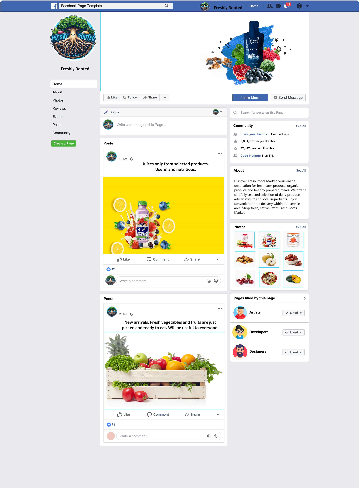

### Newsletter Marketing

Freshly Rooted Online Market will use Mailchimp to manage and send newsletters to keep subscribers updated and engaged.
Here’s how it will work:

1. **Build Subscriber List

- Collect email addresses through sign-up forms on the website and social media. Organize subscribers into groups for
  targeted messaging.

2. **Create Content

- Design newsletters with product highlights, special offers, and market updates using Mailchimp’s easy-to-use
  templates.

3. **Schedule Newsletters

- Plan regular newsletters (e.g., weekly or monthly) to keep customers informed and interested.

4. **Automate Emails

- Set up automated emails to welcome new subscribers, thank customers after purchases, and send personalized product
  recommendations.

5. **Track Results

- Monitor how newsletters perform with Mailchimp’s reports on open rates, clicks, and other key metrics. Use this
  information to improve future emails.

6. **Test and Personalize

- Test different email elements to see what works best and personalize content based on subscriber preferences.
  Using Mailchimp helps Freshly Rooted Online Market stay connected with customers, promote new products and events, and
  drive traffic to the online store.

[Back to top](#contents)

## Features

[Back to top](#contents)

### Header

The header of the Freshly Rooted Online Market site is designed to be both functional and aesthetically pleasing. It
showcases a vibrant logo and an intuitive navigation menu, with direct links to the shopping cart, wishlist, and account
settings for seamless access, whether you're logged in or just exploring as a guest. Logged-in users benefit from a
dropdown menu offering additional options such as order management, profile settings, and purchase history. The sleek
design incorporates a green accent for interactive elements, ensuring excellent contrast and accessibility. Built with
Bootstrap, the header adapts effortlessly to various screen sizes, providing a user-friendly experience on both mobile
and desktop devices. Consistent use of icons and fonts throughout the site ensures a unified and polished appearance.

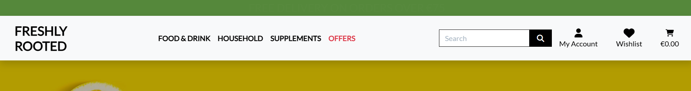

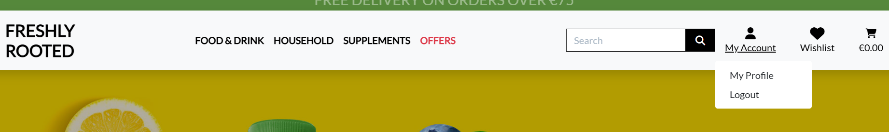

[Back to top](#contents)

### Footer

The footer of the Freshly Rooted Online Market website is thoughtfully divided into three sections to enhance user
experience. The first section offers a warm welcome message, accompanied by icons for accepted payment methods and links
to social media platforms, encouraging community engagement. The second section provides easy access to shop categories
and policy information, allowing users to explore dairy, organic foods, meals, and all-natural products, as well as
review important legal details. The final section invites users to subscribe to the newsletter, ensuring they receive
the latest updates and special offers. The footer is designed to be both practical and inviting, concluding with a
heartfelt message that emphasizes the brand's commitment to natural living and community connection.

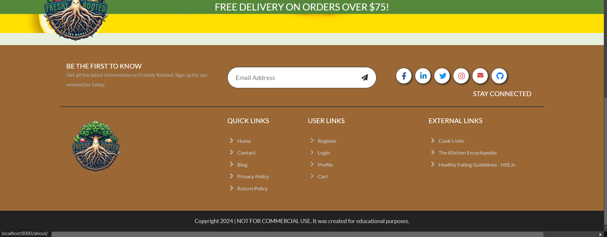

[Back to top](#contents)

### Customer Information

The footer of the Freshly Rooted Online Market website includes essential links to "Shipping & Returns," "Privacy
Policy," and "Terms of Service," providing users with crucial information about the site's policies. The Shipping &
Returns page details the delivery process, including shipping fees and return policies for dairy, organic foods, meals,
and all-natural products, ensuring customers understand how to manage their orders. The Privacy Policy explains how user
data is collected, stored, and utilized, offering transparency and assurance regarding data protection practices. The
Terms of Service page outlines the legal agreement between users and the site, establishing the rules and guidelines for
using the website. Together, these pages offer a comprehensive understanding of the site's operations and user rights,
fostering trust and clarity.

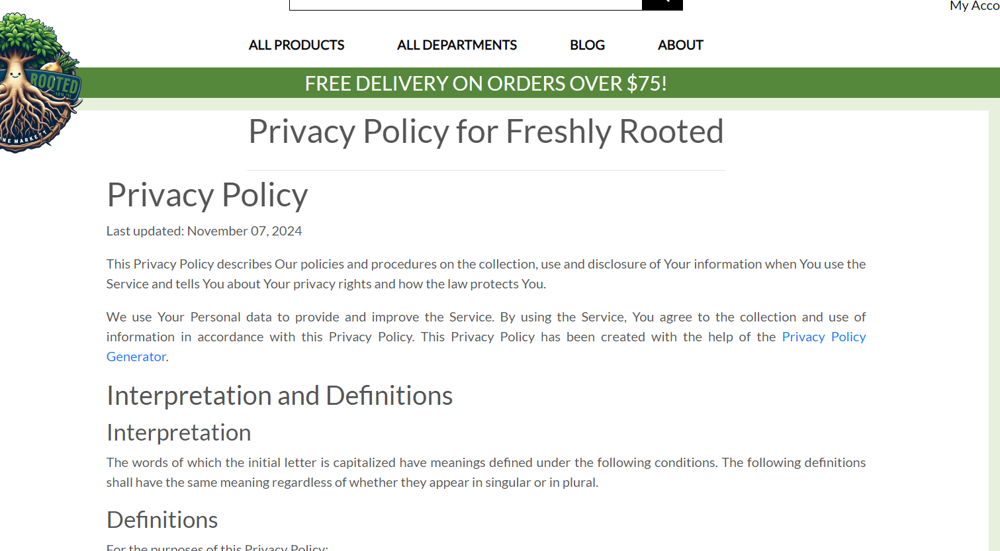
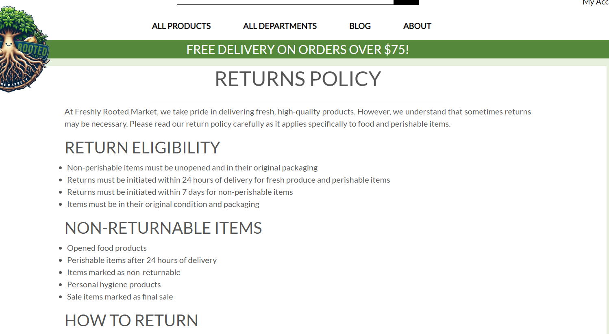

[Back to top](#contents)

### Contact

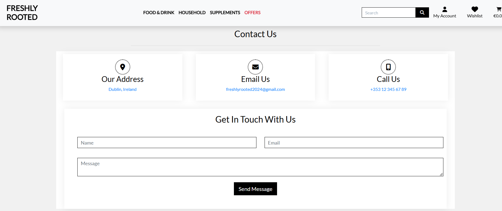

[Back to top](#contents)

### User Account Pages

The user account pages at Freshly Rooted Online Market are designed to provide a seamless and secure experience for
managing user access, enhancing the overall user journey on the site.

[Back to top](#contents)

#### Register Page

The Register page offers a straightforward and user-friendly form where users can create an account by entering their
email, first name, last name, and password. The form is designed with responsiveness in mind, ensuring it is accessible
and easy to use on any device. By focusing on a user-centric design, the Register page facilitates quick and hassle-free
registration, encouraging new users to join the community and explore a world of dairy, organic foods, meals, and
all-natural products.

After registration, users receive a message indicating that their email address needs to be verified, and a verification
email is sent to them to complete the process.

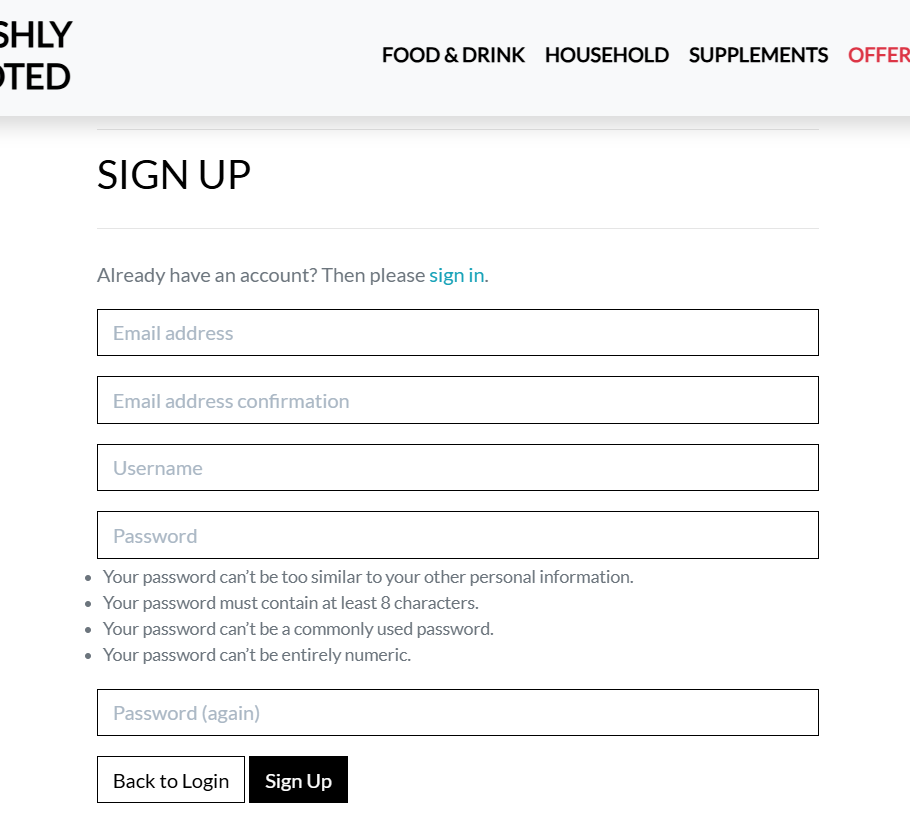

[Back to top](#contents)

#### Log In Page

The Log In page at Freshly Rooted Online Market provides a simple and secure method for existing users to access their
accounts. It features clearly labeled fields for entering a username and password, along with a prominent login button
to facilitate easy access. The design of the page aligns with the site's overall aesthetic, ensuring a cohesive and
seamless user experience. Additionally, options for password recovery and account assistance are readily available,
enhancing user convenience and support.

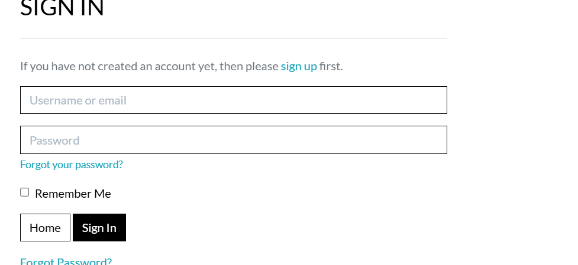
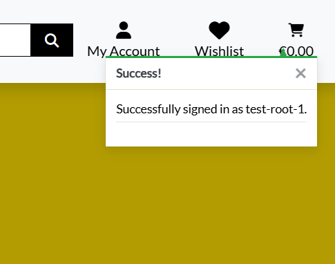

[Back to top](#contents)

#### Logout Page

The Logout page at Freshly Rooted Online Market confirms a successful logout from the user's account. It features a
concise message indicating that the user has been logged out, ensuring clarity and reassurance. The design is
minimalistic, reinforcing the action taken and offering clear options to either continue exploring the site or log in
again. This straightforward approach helps maintain a seamless user experience, even after logging out.

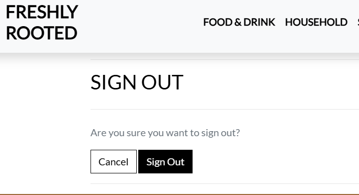

[Back to top](#contents)

### Profile Page

The user profile page at Freshly Rooted Online Market offers a personalized experience for logged-in users, featuring a
sidebar with quick links to manage account information, view order history, access the wishlist, change the password, or
delete the account. The main content area displays personal details and shipping information, with convenient options to
edit both via modals. Users can update their first name and last name under personal details, as well as their phone
number, address, and country under shipping information. The layout is clean and intuitive, making it easy for users to
manage their profiles efficiently and effectively.

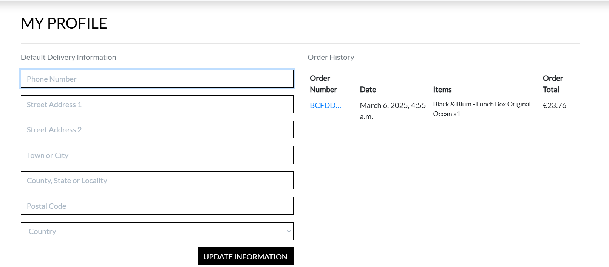

[Back to top](#contents)

#### User Favorites

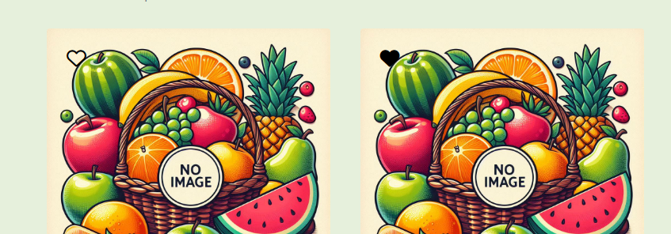
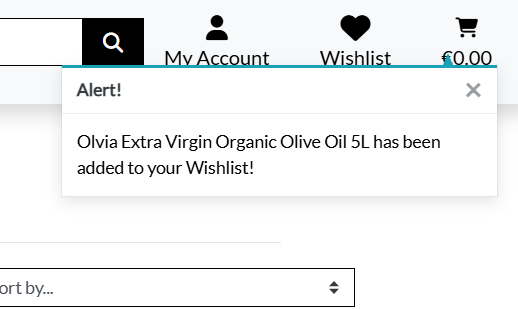

[Back to top](#contents)

### All Products

The All Products page at Freshly Rooted Online Market includes an advanced filtering system for searching products by
categories such as dairy, organic foods, meals, and all-natural products. Users can refine their search using filters
for product type, brand, and price range. Additionally, results can be sorted by name or price to help users find
exactly what they need. Each product is displayed in a grid format, featuring images, titles, and pricing details. Users
also have the option to add items to their wishlist or directly to the shopping cart, enhancing the shopping experience
with convenience and efficiency.

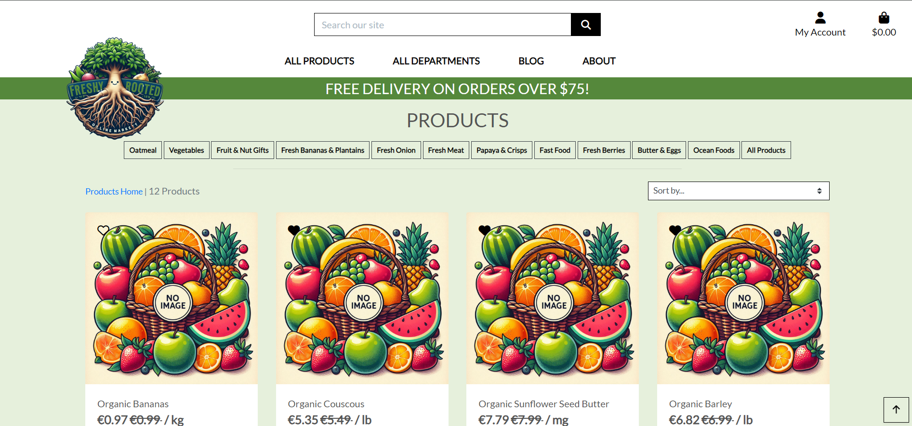

[Back to top](#contents)

### Product Details

[Back to top](#contents)

### Reviews

[Back to top](#contents)

### Search Results

[Back to top](#contents)

### Special Offers

[Back to top](#contents)

### Shopping Cart

[Back to top](#contents)

### Checkout

[Back to top](#contents)

### Order Confirmation

[Back to top](#contents)

### Product Management

[Back to top](#contents)

#### Dashboard

[Back to top](#contents)

#### Products

[Back to top](#contents)

#### Categories

[Back to top](#contents)

#### Orders

[Back to top](#contents)

### Custom Error Pages

[Back to top](#contents)

## Django Admin Portal

Django Admin Portal allows superuser to manage content and users of the website. The admin view is customized to reflect
the scope of this project.


[Back to top](#contents)

### Future Features

[Back to top](#contents)

## Deployment

[Back to top](#contents)

### AWS Cloud Service

To integrate AWS, follow steps:

#### Create and Configure an S3 Bucket

1. **Access AWS:**

    - Go to [aws.amazon.com](https://aws.amazon.com/) and log in to your AWS Management Console.

2. **Create an S3 Bucket:**

    - Search for "S3" in the AWS Management Console and create a new bucket.
    - Name the bucket to match your Heroku app name and select the region closest to your target audience.

3. **Set Public Access and Ownership:**

    - Uncheck the "Block all public access" option and acknowledge that the bucket will be public (required for
      compatibility with Heroku).
    - Under "Object Ownership," ensure "ACLs enabled" and "Bucket owner preferred" are selected.

4. **Enable Static Website Hosting:**

    - In the "Properties" tab, enable static website hosting.
    - Set `index.html` as the index document and `error.html` as the error document, then click "Save."

5. **Configure CORS (Cross-Origin Resource Sharing):**

    - In the "Permissions" tab, add the following CORS configuration:

   ```json
   [
     {
        "AllowedHeaders": ["Authorization"],
        "AllowedMethods": ["GET"],
        "AllowedOrigins": ["*"],
        "ExposeHeaders": []
     }
   ]
    ```

- Copy your bucket's **ARN** (Amazon Resource Name).


6. **Add a Bucket Policy:**

    - Go to the "Bucket Policy" tab and click on the "Policy Generator" link.
    - Configure the policy:
        - **Policy Type:** S3 Bucket Policy
        - **Effect:** Allow
        - **Principal:** \*
        - **Actions:** `s3:GetObject`
        - **ARN:** Paste your bucket's ARN
    - Click "Add Statement" and "Generate Policy."
    - Copy the generated policy and paste it into the "Bucket Policy Editor":

   ``` json 
   {
     "Version": "2012-10-17",
     "Statement": [
       {
         "Effect": "Allow",
         "Principal": "*",
         "Action": "s3:GetObject",
         "Resource": "arn:aws:s3:::your-bucket-name/*"
       }
     ]
   }
    ```

- Ensure the `Resource` field ends with `/*` and click "Save."


7. **Adjust Access Control List (ACL):**

    - In the "Access Control List" (ACL) section, click "Edit" and enable "List" for Everyone (public access). Accept
      the warning prompt.
    - If the edit option is disabled, ensure the "Object Ownership" settings have ACLs enabled.

[Back to top](#contents)

#### Configure IAM (Identity and Access Management)

1. **Create a User Group:**

    - Navigate to the IAM service and select "User Groups."
    - Click "Create New Group," and name it appropriately (e.g., ``).

2. **Attach Policies to the Group:**

    - Select the newly created group and go to the "Permissions" tab.
    - Click "Add Permissions" > "Attach Policies."
    - In the "JSON" tab, click "Import Managed Policy" and search for `AmazonS3FullAccess`.
    - Import the policy and modify it to limit access to your specific bucket:

   ```json
   {
     "Version": "2012-10-17",
     "Statement": [
       {
         "Effect": "Allow",
         "Action": "s3:*",
         "Resource": [
           "arn:aws:s3:::your-bucket-name",
           "arn:aws:s3:::your-bucket-name/*"
         ]
       }
     ]
   }
    ```

- Click "Review Policy" and name it (e.g., `your-policy`), then click "Create Policy."


3. **Add Users and Assign Permissions:**

    - Go back to "User Groups," select your group, and click "Attach Policy."
    - Select your custom policy (e.g., `your-policy`) and attach it.
    - Click "Add User" and name it appropriately (e.g., `your-user-name`).
    - Select "Programmatic Access" and add the user to your group.
    - Download the CSV file containing the `AWS_ACCESS_KEY_ID` and `AWS_SECRET_ACCESS_KEY`.

[Back to top](#contents)

#### Final AWS Setup and Heroku Integration

1. **Update Heroku Configurations:**

    - Remove `DISABLE_COLLECTSTATIC` from Heroku Config Vars to enable AWS management of static files.

2. **Create Media Directory:**

    - Within your S3 bucket, create a new folder named `media`.
    - Upload your media files into this folder and set "Public read access."

3. **Security Reminder:**

    - Ensure all sensitive information (like AWS credentials) is securely stored and not hard-coded into your source
      code.

[Back to top](#contents)

### Stripe

[Back to top](#contents)

#### Steps for Stripe Integration

1. **Create a Stripe Account:**

    - Go to [stripe.com](https://stripe.com) and create an account. Log in to your Stripe dashboard.

2. **Obtain API Keys:**

    - From your Stripe dashboard, locate the "API Keys" section under "Developers."
    - Retrieve the following keys:
        - **STRIPE_PUBLIC_KEY**: Your Publishable Key (starts with `pk`)
        - **STRIPE_SECRET_KEY**: Your Secret Key (starts with `sk`)
    - These keys will be used to authenticate your application with Stripe.

3. **Configure Webhooks for Payment Events:**

    - To handle scenarios where a user may close the payment page prematurely, set up Stripe Webhooks to receive
      real-time payment updates.
    - In your Stripe dashboard:
        - Navigate to "Developers" and select "Webhooks."
        - Click "Add Endpoint."
        - Enter your endpoint URL (e.g., ``).
        - Select "Receive all events" to capture all relevant payment events.
        - Click "Add Endpoint" to complete the process.
        - This will generate a new key:
        - **STRIPE_WH_SECRET**: Your Webhook Signing Secret (starts with `wh`).

[Back to top](#contents)

#### Testing Stripe Payments

1. **Test Mode:**

    - Stripe provides a test mode to simulate payment transactions.
    - Use the following test card details for interactive testing:
        - **Card Number:** `4242 4242 4242 4242`
        - **Expiry Date:** Any valid future date (e.g., `12/34`)
        - **CVC:** Any three-digit number (or four digits for American Express)
        - **Other Fields:** Use any value for other fields.

2. **Security Reminder:**

    - Ensure all Stripe API keys and Webhook Signing Secrets are stored securely, and never hard-code them in your
      source code.

[Back to top](#contents)

### GMAIL

[Back to top](#contents)

#### Steps for Gmail Integration

1. **Create and Access Gmail Account:**

    - Ensure you have an active Gmail (Google) account. Log in to your account.

2. **Enable Two-Factor Authentication (2FA):**

    - Go to your Google Account by clicking on your profile icon in the top-right corner and selecting "Manage Your
      Google Account."
    - Navigate to the **Security** tab on the left sidebar.
    - Under the "Signing in to Google" section, enable **2-Step Verification**. Follow the prompts to verify your
      password and activate 2FA.

3. **Generate an App Password:**

    - After enabling 2FA, stay on the **Security** page and select **App passwords**.
    - Re-enter your password if prompted.
    - Choose **Mail** as the app type and select **Other (Custom name)** for the device type. Enter a relevant name (
      e.g., "Your Django App").
    - Click **Generate** to create a 16-character app password (API key). **Note:** This password will only be displayed
      once, so save it securely.

4. **Configure Email Settings in Your Application:**

    - Update your application's email settings with the following credentials:
        - **EMAIL_HOST_USER**: Your Gmail address (e.g., `your-email@gmail.com`)
        - **EMAIL_HOST_PASSWORD**: The 16-character app password generated from Gmail.

[Back to top](#contents)

#### Security and Compliance

- Ensure that your Gmail credentials, especially the app password, are stored securely and not hard-coded in your source
  code. Consider using environment variables or a secure secrets manager for this purpose.

[Back to top](#contents)

### Deployment Process with Heroku

1. Navigate to the [Heroku website](https://www.heroku.com/) and either [log in](https://id.heroku.com/login) to your
   existing account or [sign up](https://signup.heroku.com/) for a new account.
2. From the dashboard, click the "New" button in the upper right corner and select "Create new App" from the drop-down
   menu.
3. Provide a unique name for your application in the "App name" field.
    - Heroku will indicate the name's availability with a green checkmark.
4. Select the appropriate region ("United States" or "Europe") from the "Choose a region" dropdown, based on your target
   user base.
5. Click the "Create app" button to proceed.
6. On the next screen, navigate to the "Settings" tab located at the top center of the page.
7. In the "Config Vars" section, click on the "Reveal config Vars" button to display the environment variable
   configuration interface.
8. Input the necessary environment variables typically stored in your local [.env](env.example) file. For this
   deployment, you will
   need to configure the following variables:

```shell
DEBUG = False
DEVELOPMENT = False
USE_STORAGE = True
USE_DATABASE = True
IS_LOGGING = False
LANGUAGE_CODE = 'en-us'
SITE_ID = 1
DJANGO_SECRET_KEY = 'your-secret-key'
DATABASE_NAME = 'mydatabase'
DATABASE_USER = 'dbuser'
DATABASE_PASSWORD = 'password'
DATABASE_HOST = 'localhost'
DATABASE_PORT = '5432'
ALLOWED_HOSTS = ['example.com', 'localhost']
CSRF_TRUSTED_ORIGINS = ['https://example.com']
STRIPE_PUBLIC_KEY = 'your-stripe-public-key'
STRIPE_SECRET_KEY = 'your-stripe-secret-key'
STRIPE_WH_SECRET = 'your-stripe-webhook-secret'
AWS_STORAGE_BUCKET_NAME = 'your-bucket-name'
AWS_S3_REGION_NAME = 'us-west-2'
AWS_ACCESS_KEY_ID = 'your-access-key-id'
AWS_SECRET_ACCESS_KEY = 'your-secret-access-key'
CLOUDINARY_CLOUD_NAME = 'your-cloud-name'
CLOUDINARY_API_KEY = 'your-cloudinary-api-key'
CLOUDINARY_API_SECRET = 'your-cloudinary-api-secret'
EMAIL_HOST = 'smtp.example.com'
EMAIL_PORT = 587
EMAIL_HOST_USER = 'user@example.com'
EMAIL_HOST_PASSWORD = 'email-password'
DEFAULT_FROM_EMAIL = 'webmaster@localhost'
```

9. Enter each variable name in the "KEY" field and its corresponding value in the "VALUE" field.
10. Return to the top of the page and select the "Deploy" tab.
11. In the "Deployment method" section, choose "GitHub."
12. Under "Connect to GitHub," click the "Search" button, locate your project repository, and click "Connect."
13. Scroll down and click the "Deploy Branch" button to initiate the deployment.
14. Consider enabling the automatic deployment option to allow Heroku to deploy your app automatically with each push to
    the GitHub repository.
15. A build log will appear at the bottom of the screen. Upon successful deployment, a link to your application will be
    provided.

**Important!**: Ensure that your Heroku app URL is added to the `ALLOWED_HOSTS` setting in the `settings.py` file.
Additionally, verify that the `DEBUG` setting is set to `False`, and the `requirements.txt` and `Procfile` are up to
date and committed to GitHub.

[Back to top](#contents)

### To fork the project

Forking the **GitHub** repository allows you to create a duplicate of a local repository. This is done so that
modifications to the copy can be performed without compromising the original repository.

- Log in to **GitHub**.

- Locate the repository.

- Click to open it.

- The fork button is located on the right side of the repository menu.

- To copy the repository to your **GitHub** account, click the button.

[Back to top](#contents)

### To clone the project

- Log in to **GitHub**.

- Navigate to the main page of the repository and click **Code**.

- Copy the **URL** for the repository.

- Open your local **IDE**.

- Change the current working directory to the location where you want the cloned directory.

- Type git clone, and then paste the **URL** you copied earlier.

- Press **Enter** to create your local clone.

_Any changes required to the website, they can be made, committed and pushed to GitHub._

[Back to top](#contents)

## Testing

[TESTING.md](TESTING.md) file.

[Back to top](#contents)

## Technology

### Languages

- [Python](https://www.python.org/)
- [Markdown](https://en.wikipedia.org/wiki/Markdown)
- [HTML](https://developer.mozilla.org/en-US/docs/Glossary/HTML5 'HTML')
- [CSS](https://developer.mozilla.org/en-US/docs/Web/CSS 'CSS')
- [JS](https://developer.mozilla.org/en-US/docs/Web/JavaScript 'JS')

[Back to top](#contents)

### Frameworks

- [Django](https://www.djangoproject.com/): Django is the main Python framework used in the development of this project.
  It provides a robust and scalable architecture for building web applications.

[Back to top](#contents)

### Python Libraries

- [Django-allauth](https://django-allauth.readthedocs.io/en/latest/installation.html): Authentication library used to
  create user accounts, providing features such as registration, login, and social authentication.
- [Crispy Forms](https://django-crispy-forms.readthedocs.io/en/latest/): Used to manage Django forms, making form
  rendering in templates simpler and more elegant.
- [Django Countries](https://pypi.org/project/django-countries/): Library used to provide country choices for use with
  forms and a country field for models.
- [Pillow](https://pypi.org/project/Pillow/): Used to add image processing capabilities.
- [Humanize](https://pypi.org/project/humanize/): Used for turning a number into a fuzzy human-readable duration ("3
  minutes ago")

[Back to top](#contents)

### Programs

- [Balsamiq](https://balsamiq.com/): Wireframing tool used to generate wireframe images, allowing for quick and easy
  visualization of the application's layout and design.
- [Bootstrap](https://getbootstrap.com): CSS framework used for developing responsiveness and styling, offering a wide
  range of pre-designed components and utilities.
- [Google Chrome](https://developer.chrome.com/docs/devtools/): Used for overall development and tweaking, including
  testing responsiveness, debugging, and performance profiling.

[Back to top](#contents)

### Payment Service

- [Stripe](https://stripe.com/en-gb-nl) was used to process all online payments transactions.

### Cloud Storage

- [Amazon Web Service S3](https://aws.amazon.com/s3/) was used to store all static and media files in production.

[Back to top](#contents)

## Credits

[Back to top](#contents)

## Disclaimer

_FreshlyRooted Market is dedicated to providing free, reliable information and resources to its community. This project
is not driven by monetary profit, but rather by a commitment to share knowledge and support well-being. Every effort has
been made to properly credit and reference all images, data, and materials used. Any photographs or other media have
been obtained through free and accessible sources in accordance with usage agreements, ensuring that all content is
responsibly sourced._

[Back to top](#contents)
