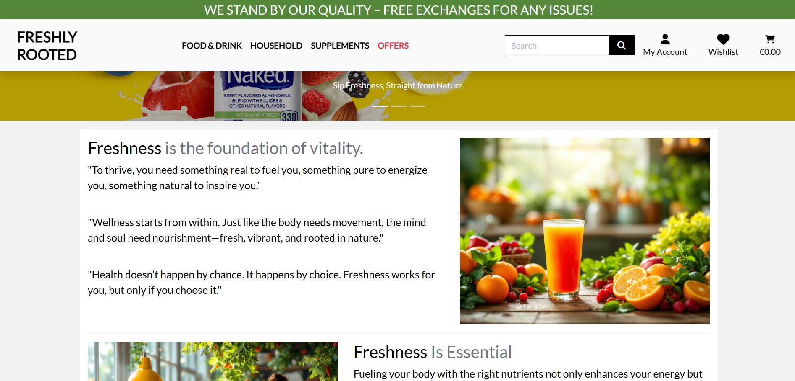
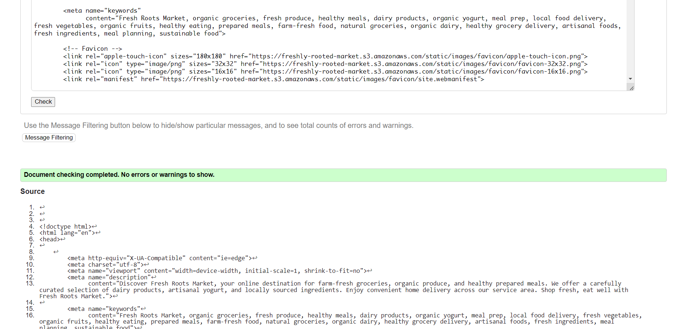
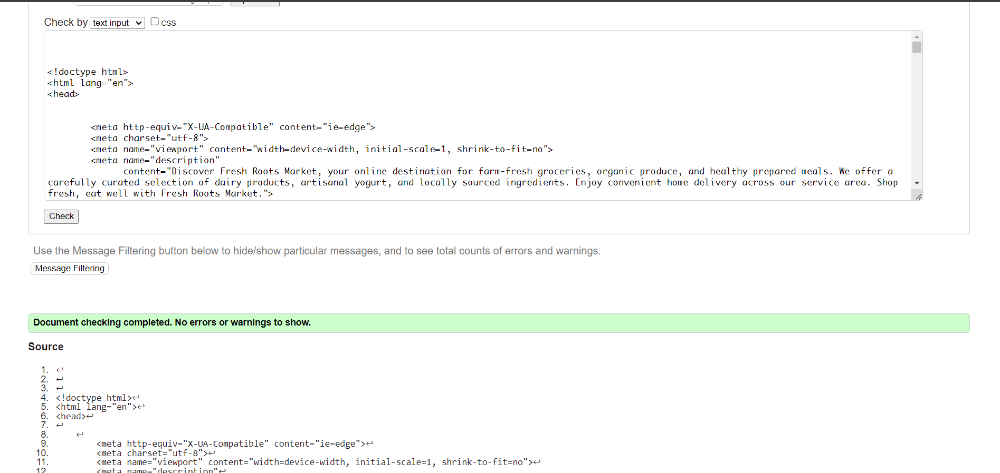
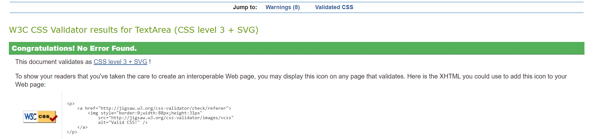
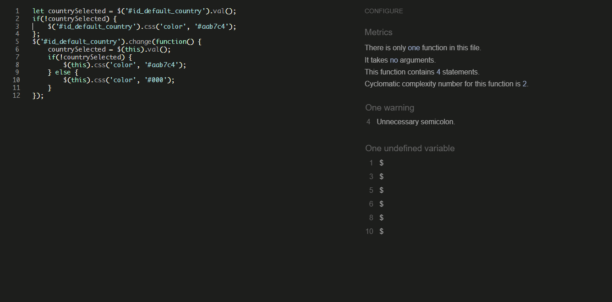
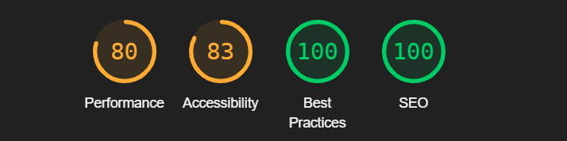

# Testing

Return back to the [README.md](README.md) file.

# Contents

<!-- TOC -->

* [Testing](#testing)
* [Contents](#contents)
    * [Responsiveness Tests](#responsiveness-tests)
    * [Code Validation](#code-validation)
        * [HTML](#html)
        * [CSS](#css)
        * [JavaScript](#javascript)
        * [Python](#python)
        * [Python (Unit Testing)](#python-unit-testing)
    * [Manual Testing](#manual-testing)
    * [Role-based Restrictions](#role-based-restrictions)
    * [Bugs](#bugs)
    * [Browser Compatibility](#browser-compatibility)
    * [User Story Testing](#user-story-testing)
    * [Lighthouse Testing](#lighthouse-testing)
    * [Accessibility Testing](#accessibility-testing)

<!-- TOC -->

## Responsiveness Tests

I adopted a mobile-first strategy and verified all modifications using the DevTools in Google Chrome and Microsoft Edge.

Additionally, I used
the [Google Chrome Mobile Simulator extension](https://chromewebstore.google.com/detail/mobile-simulator-responsi/ckejmhbmlajgoklhgbapkiccekfoccmk)
to evaluate responsiveness on more specialized
devices. I examined device samples for navigation, element alignment, content layout, and functionality issues across
different breakpoints.

Test Results:

| Size | Device Example     | Navigation         | Element Alignments | Content Placement  | Functionality      | Notes |
|------|--------------------|--------------------|--------------------|--------------------|--------------------|-------|
| sm   | Samsung Galaxy S20 | :white_check_mark: | :white_check_mark: | :white_check_mark: | :white_check_mark: |       |
| sm   | iPhone 11 PRO      | :white_check_mark: | :white_check_mark: | :white_check_mark: | :white_check_mark: |       |
| sm   | iPhone 13 PRO MAX  | :white_check_mark: | :white_check_mark: | :white_check_mark: | :white_check_mark: |       |
| md   | iPad MINI          | :white_check_mark: | :white_check_mark: | :white_check_mark: | :white_check_mark: |       |
| md   | Galaxy Tab S7      | :white_check_mark: | :white_check_mark: | :white_check_mark: | :white_check_mark: |       |
| md   | iPad Air           | :white_check_mark: | :white_check_mark: | :white_check_mark: | :white_check_mark: |       |
| lg   | iPad Pro           | :white_check_mark: | :white_check_mark: | :white_check_mark: | :white_check_mark: |       |
| xl   | Mackbook Air       | :white_check_mark: | :white_check_mark: | :white_check_mark: | :white_check_mark: |       |
| xl   | HP Stream Laptop   | :white_check_mark: | :white_check_mark: | :white_check_mark: | :white_check_mark: |       |
| xxl  | Dell Lattitude     | :white_check_mark: | :white_check_mark: | :white_check_mark: | :white_check_mark: |       |
| xxl  | Desktop            | :white_check_mark: | :white_check_mark: | :white_check_mark: | :white_check_mark: |       |

[Back to top](#contents) :top:

## Code Validation

### HTML

The recommended [HTML W3C Validator](https://validator.w3.org) to validate all the project's HTML files.

This is the process which was followed of validating an HTML file by direct input:

1. **Access the Validator**: Visit the [W3C Markup Validation Service](https://validator.w3.org/).
2. **Choose Direct Input**: Select the "Validate by Direct Input" tab.
3. **Paste Your HTML Code**: Copy HTML code and paste it into the text box.
4. **Validate**: Click the "Check" button to validate HTML.

HTML Validation Results

| File Name                   | Pass               | Notes             | View Result                                                    |
|-----------------------------|--------------------|-------------------|----------------------------------------------------------------|
| home page desktop           | :white_check_mark: |                   |             |
| home page mobile            | :white_check_mark: |                   |              |
| products page desktop       | :white_check_mark: |                   |         |
| products page mobile        | :white_check_mark: |                   |          |       
| blog page desktop           | :white_check_mark: |                   |            |       
| blog page mobile            | :white_check_mark: |                   |             |       
| blog post page desktop      | :white_check_mark: |                   |       |       
| blog post page mobile       | :white_check_mark: |                   |        |       
| contact page desktop        | :white_check_mark: |                   |         |       
| contact page mobile         | :white_check_mark: |                   |          |       
| privacy policy page desktop | :white_check_mark: |                   |  |       
| privacy policy page mobile  | :white_check_mark: |                   |   |       
| return policy page desktop  | :white_check_mark: |                   |   |
| return policy page mobile   | :white_check_mark: |                   |    |       
| cart page desktop           | :white_check_mark: |                   |            |       
| cart page mobile            | :white_check_mark: |                   |             |       
| profile page desktop        | :white_check_mark: | From crispy forms |         |       
| profile page mobile         | :white_check_mark: | From crispy forms |          |       
| favorites page desktop      | :white_check_mark: |                   |       |       
| favorites page mobile       | :white_check_mark: |                   |        |       |
| logout page desktop         | :white_check_mark: |                   |          |       
| logout page mobile          | :white_check_mark: |                   |           |       
| register page desktop       | :white_check_mark: |                   |        |       
| register page mobile        | :white_check_mark: |                   |        |       
| login page desktop          | :white_check_mark: |                   |           |       
| login page mobile           | :white_check_mark: |                   |            |       

[Back to top](#contents) :top:

### CSS

The [W3C Jigsaw](https://jigsaw.w3.org/css-validator/) tool, provided by the W3C, enables to validate and verify the
correctness of CSS code. It ensures that your web pages adhere to W3C standards, promoting interoperability and
accessibility.

CSS Validation Results

| File Name     | Pass               | View Result                                                |
|---------------|--------------------|------------------------------------------------------------|
| base.css      | :white_check_mark: |       |
| favorites.css | :white_check_mark: |  |
| checkout.css  | :white_check_mark: |  |

### JavaScript

No major errors were found when validating JavaScript through [Jshint](https://jshint.com/).

JavaScript Validation Results

| File Name    | Pass               | View Result                                                  |
|--------------|--------------------|--------------------------------------------------------------|
| countryfield | :white_check_mark: |  |
| blog         | :white_check_mark: |          |

### Python

The python files have all been passed through [PEP8 CI Online](https://pep8ci.herokuapp.com/)

<b>PEP8 Test Results</b>

| App Name  | File Name          | Pass               | Notes | View Result                                                                                               |
|-----------|--------------------|--------------------|-------|-----------------------------------------------------------------------------------------------------------|
| about     | views.py           | :white_check_mark: |       | 

Screenshot

              |
| about     | urls.py            | :white_check_mark: |       | 

Screenshot

               |
| about     | models.py          | :white_check_mark: |       | 

Screenshot

             |
| about     | forms.py           | :white_check_mark: |       | 

Screenshot

              |
| about     | admin.py           | :white_check_mark: |       | 

Screenshot

              |
| about     | test_views.py      | :white_check_mark: |       | 

Screenshot

       |
| about     | test_forms.py      | :white_check_mark: |       | 

Screenshot

         |
| app       | settings.py        | :white_check_mark: |       | 

Screenshot

                 |
| app       | urls.py            | :white_check_mark: |       | 

Screenshot

    |
| app       | views.py           | :white_check_mark: |       | 

Screenshot

           |
| blog      | views.py           | :white_check_mark: |       | 

Screenshot

               |
| blog      | urls.py            | :white_check_mark: |       | 

Screenshot

                |
| blog      | models.py          | :white_check_mark: |       | 

Screenshot

              |
| blog      | forms.py           | :white_check_mark: |       | 

Screenshot

               |
| blog      | admin.py           | :white_check_mark: |       | 

Screenshot

               |
| blog      | test_views.py      | :white_check_mark: |       | 

Screenshot

          |
| blog      | test_models.py     | :white_check_mark: |       | 

Screenshot

         |
| cart      | views.py           | :white_check_mark: |       | 

Screenshot

               |
| cart      | urls.py            | :white_check_mark: |       | 

Screenshot

                |
| cart      | contexts.py        | :white_check_mark: |       | 

Screenshot

             |
| cart      | test_context.py    | :white_check_mark: |       | 

Screenshot

        |
| checkout  | webhooks.py        | :white_check_mark: |       | 

Screenshot

        |
| checkout  | webhook_handler.py | :white_check_mark: |       | 

Screenshot

 |
| checkout  | views.py           | :white_check_mark: |       | 

Screenshot

             |
| checkout  | urls.py            | :white_check_mark: |       | 

Screenshot

            |
| checkout  | signals.py         | :white_check_mark: |       | 

Screenshot

         |
| checkout  | models.py          | :white_check_mark: |       | 

Screenshot

          |
| checkout  | forms.py           | :white_check_mark: |       | 

Screenshot

           |
| checkout  | admin.py           | :white_check_mark: |       | 

Screenshot

           |
| checkout  | test_models.py     | :white_check_mark: |       | 

Screenshot

     |
| checkout  | test_forms.py      | :white_check_mark: |       | 

Screenshot

      |
| favorites | views.py           | :white_check_mark: |       | 

Screenshot

          |
| favorites | urls.py            | :white_check_mark: |       | 

Screenshot

           |
| favorites | models.py          | :white_check_mark: |       | 

Screenshot

         |
| favorites | admin.py           | :white_check_mark: |       | 

Screenshot

          |
| favorites | test_models.py     | :white_check_mark: |       | 

Screenshot

    |
| home      | views.py           | :white_check_mark: |       | 

Screenshot

               |
| home      | urls.py            | :white_check_mark: |       | 

Screenshot

                |
| products  | widgets.py         | :white_check_mark: |       | 

Screenshot

         |
| products  | views.py           | :white_check_mark: |       | 

Screenshot

           |
| products  | urls.py            | :white_check_mark: |       | 

Screenshot

            |
| products  | models.py          | :white_check_mark: |       | 

Screenshot

          |
| products  | forms.py           | :white_check_mark: |       | 

Screenshot

           |
| products  | admin.py           | :white_check_mark: |       | 

Screenshot

           |
| products  | test_views.py      | :white_check_mark: |       | 

Screenshot

      |
| products  | test_models.py     | :white_check_mark: |       | 

Screenshot

      |
| products  | test_forms.py      | :white_check_mark: |       | 

Screenshot

      |
| profiles  | views.py           | :white_check_mark: |       | 

Screenshot

           |
| profiles  | urls.py            | :white_check_mark: |       | 

Screenshot

            |
| profiles  | models.py          | :white_check_mark: |       | 

Screenshot

          |
| profiles  | forms.py           | :white_check_mark: |       | 

Screenshot

           |
| profiles  | test_forms.py      | :white_check_mark: |       | 

Screenshot

         |
| main      | custom_storages.py | :white_check_mark: |       | 

Screenshot

        |

 

[Back to top](#contents) :top:

## Manual Testing

In addition to using `unittest`, extensive manual testing was performed on the application. Each feature was verified
against success criteria. Where applicable, negative testing was conducted by providing invalid or unexpected inputs to
assess the application's robustness in handling errors and exceptions.

Manual Testing Results
:white_chec k_mark:
## **AUTHENTICATION**

| Test Case                       | Element                                    | Action                               | Expected Outcome                                        | Result              |
|---------------------------------|--------------------------------------------|--------------------------------------|---------------------------------------------------------|---------------------|
| Register with Valid Credentials | Registration form fields (email, password) | Fill out form with valid credentials | User redirected to home page, welcome message displayed | :white_chec k_mark: |
| Register with Existing Email    | Registration form                          | Use existing email address           | Error message "Email already exists" shown              | :white_chec k_mark: |
| Login with Valid Credentials    | Login form                                 | Enter valid email/password           | Successfully logged in, redirected to home              | :white_chec k_mark: |
| Login with Invalid Credentials  | Login form                                 | Enter incorrect password             | Error message shown, remains on login page              | :white_chec k_mark: |
| Password Reset                  | Reset form                                 | Request password reset               | Reset email sent to user                                | :white_chec k_mark: |
| Logout                          | Logout button                              | Click logout                         | User logged out, session ended                          | :white_chec k_mark: |

## **PRODUCT CATALOG**

| Test Case            | Element          | Action                    | Expected Outcome                   | Result              |
|----------------------|------------------|---------------------------|------------------------------------|---------------------|
| Filter by Category   | Category filters | Select "Organic Produce"  | Shows only organic produce items   | :white_chec k_mark: |
| Filter by Diet Type  | Diet filters     | Select "Vegan"            | Shows only vegan products          | :white_chec k_mark: |
| Sort by Price        | Sort dropdown    | Select "Price Low-High"   | Products sorted by ascending price | :white_chec k_mark: |
| Search Products      | Search bar       | Search "organic juice"    | Relevant juice products displayed  | :white_chec k_mark: |
| View Product Details | Product card     | Click product image       | Shows detailed product information | :white_chec k_mark: |
| Check Stock Status   | Stock indicator  | View product availability | Shows in/out of stock status       | :white_chec k_mark: |

## **MEAL PLANS**

| Test Case                | Element            | Action                     | Expected Outcome                     | Result              |
|--------------------------|--------------------|----------------------------|--------------------------------------|---------------------|
| Browse Meal Plans        | Meal plan section  | View available plans       | Shows different meal plan options    | :white_chec k_mark: |
| Customize Plan           | Plan customization | Select dietary preferences | Plan adjusted to preferences         | :white_chec k_mark: |
| Select Delivery Schedule | Schedule selector  | Choose delivery frequency  | Schedule confirmed                   | :white_chec k_mark: |
| View Meal Contents       | Meal details       | Click meal preview         | Shows ingredients and nutrition info | :white_chec k_mark: |

## **SHOPPING CART**

| Test Case           | Element           | Action                   | Expected Outcome            | Result              |
|---------------------|-------------------|--------------------------|-----------------------------|---------------------|
| Add to Cart         | Add button        | Click "Add to Cart"      | Product added, cart updated | :white_chec k_mark: |
| Update Quantity     | Quantity selector | Change product quantity  | Quantity and total updated  | :white_chec k_mark: |
| Remove Item         | Remove button     | Remove product from cart | Item removed, total updated | :white_chec k_mark: |
| Apply Coupon        | Coupon field      | Enter valid code         | Discount applied to total   | :white_chec k_mark: |
| Check Minimum Order | Cart total        | Add items below minimum  | Warning message shown       | :white_chec k_mark: |

## **CHECKOUT**

| Test Case              | Element           | Action                 | Expected Outcome               | Result              |
|------------------------|-------------------|------------------------|--------------------------------|---------------------|
| Enter Delivery Address | Address form      | Input delivery details | Address validated and saved    | :white_chec k_mark: |
| Select Delivery Time   | Time slots        | Choose delivery window | Time slot reserved             | :white_chec k_mark: |
| Payment Processing     | Payment form      | Enter payment details  | Payment processed successfully | :white_chec k_mark: |
| Order Confirmation     | Confirmation page | Complete checkout      | Order confirmed, email sent    | :white_chec k_mark: |

## **USER PROFILE**

| Test Case            | Element            | Action                        | Expected Outcome         | Result              |
|----------------------|--------------------|-------------------------------|--------------------------|---------------------|
| View Order History   | Orders section     | Check past orders             | Shows order history      | :white_chec k_mark: |
| Save Preferences     | Preferences form   | Update dietary preferences    | Preferences saved        | :white_chec k_mark: |
| Manage Subscriptions | Subscription panel | Modify meal plan subscription | Changes saved            | :white_chec k_mark: |
| Update Payment Info  | Payment settings   | Update payment method         | New payment method saved | :white_chec k_mark: |

## **ADMIN DASHBOARD**

| Test Case        | Element          | Action                  | Expected Outcome            | Result              |
|------------------|------------------|-------------------------|-----------------------------|---------------------|
| Manage Inventory | Inventory panel  | Update stock levels     | Stock counts updated        | :white_chec k_mark: |
| Process Orders   | Order management | View and process orders | Orders properly fulfilled   | :white_chec k_mark: |
| Update Products  | Product editor   | Edit product details    | Changes saved and displayed | :white_chec k_mark: |
| Manage Users     | User management  | View user accounts      | Access to user information  | :white_chec k_mark: |

## **SPECIAL FEATURES**

| Test Case            | Element            | Action                     | Expected Outcome           | Result              |
|----------------------|--------------------|----------------------------|----------------------------|---------------------|
| Nutrition Calculator | Calculator tool    | Enter meal selections      | Shows nutritional totals   | :white_chec k_mark: |
| Recipe Suggestions   | Recipe section     | View recommended recipes   | Relevant recipes shown     | :white_chec k_mark: |
| Seasonal Products    | Seasonal filter    | View seasonal items        | Current season items shown | :white_chec k_mark: |
| Subscription Savings | Savings calculator | View subscription benefits | Shows price comparisons    | :white_chec k_mark: |

## Role-based Restrictions

| Admin Access              | Test Pass           |
|---------------------------|---------------------|
| Full inventory management | :white_chec k_mark: |
| Order processing          | :white_chec k_mark: |
| User management           | :white_chec k_mark: |
| Content management        | :white_chec k_mark: |

| Registered User Access  | Test Pass           |
|-------------------------|---------------------|
| Place orders            | :white_chec k_mark: |
| Manage profile          | :white_chec k_mark: |
| View order history      | :white_chec k_mark: |
| Subscribe to meal plans | :white_chec k_mark: |

| Guest Access     | Test Pass           |
|------------------|---------------------|
| Browse products  | :white_chec k_mark: |
| View public info | :white_chec k_mark: |
| Create account   | :white_chec k_mark: |

This test documentation covers the core functionality of an organic food marketplace. You can expand or modify these
test cases based on your specific features and requirements.

[Back to top](#contents) :top:

## Bugs

[Back to top](#contents) :top:

## Browser Compatibility

The deployed project was tested on the most popular browsers for compatibility issues.
No major issues identified.

<table>
    <thead>    
        <tr> 
            <th rowspan="2">Page</th> 
            <th colspan="5">Mobile</th> 
            <th colspan="5">Tablet</th> 
            <th colspan="5">Desktop</th> 
            <th rowspan="2">Note</th> 
        </tr>
        <tr> 
            <th>Edge</th>
            <th>Firefox</th>
            <th>Chrome</th>
            <th>Opera</th>
            <th>Safari</th>
            <th>Edge</th>
            <th>Firefox</th>
            <th>Chrome</th>
            <th>Opera</th>
            <th>Safari</th>
            <th>Edge</th>
            <th>Firefox</th>
            <th>Chrome</th>
            <th>Opera</th>
            <th>Safari</th>
        </tr>
    </thead>
    <tbody>    
        <tr>
            <td>Home</td>
            <td>:white_chec k_mark:</td> 
            <td>:white_chec k_mark:</td> 
            <td>:white_check_mark:</td> 
            <td>:white_check_mark:</td> 
            <td>:✗:</td> 
            <td>:white_chec k_mark:</td> 
            <td>:white_chec k_mark:</td> 
            <td>:white_check_mark:</td> 
            <td>:white_check_mark:</td> 
            <td>:✗:</td>
            <td>:white_chec k_mark:</td> 
            <td>:white_chec k_mark:</td> 
            <td>:white_check_mark:</td> 
            <td>:white_check_mark:</td> 
            <td>:✗:</td> 
            <td>Test issue on Safari</td>
        </tr>
        <tr>
            <td>Contact</td >
            <td>:white_check_mark:</td> 
            <td>:white_check_mark:</td> 
            <td>:white_check_mark:</td> 
            <td>:✗:</td> 
            <td>:white_chec k_mark:</td> 
            <td>:white_chec k_mark:</td> 
            <td>:white_chec k_mark:</td> 
            <td>:white_chec k_mark:</td> 
            <td>:white_chec k_mark:</td> 
            <td>:white_chec k_mark:</td>
            <td> :white_check_mark:</td> 
            <td>:white_check_mark:</td> 
            <td>:✗:</td> 
             <td>:white_chec k_mark:</td> 
            <td>:white_check_mark:</td> 
            <td>Issue on Opera in Tablet</td>
        </tr>
    </tbody>
</table>

[Browser Testing Results]()

## User Story Testing

## Dev Role User Stories

| User Story               | Status | Notes                                  |
|--------------------------|--------|----------------------------------------|
| Adopt Agile Methodology  | ✅      | Documented in README.md                |
| Design Database Schema   | ✅      | ERD and schema documented in README.md |
| Create Wireframes        | ✅      | Balsamiq wireframes in README.md       |
| Design Visuals           | ✅      | Color scheme and typography documented |
| Create Django Project    | ✅      | Git Commit #d469c28                    |
| AWS Integration          | ✅      | Static/media files configuration       |
| Performance Optimization | ✅      | Documented in TESTING.md               |
| Code Validation          | ✅      | Python, JS, CSS validation results     |
| SEO Implementation       | ✅      | Meta tags and sitemap.xml added        |
| Marketing Strategy       | ✅      | Social media marketing plan documented |

## Visitor User Stories

| User Story              | Status | Implementation Details                       |
|-------------------------|--------|----------------------------------------------|
| Browse Organic Products | ✅      | Product catalog with filters                 |
| View Meal Plans         | ✅      | Meal plan comparison page                    |
| Newsletter Signup       | ✅      | Footer signup form                           |
| Navigation Experience   | ✅      | Intuitive menu structure                     |
| Product Search          | ✅      | Search by name/category/dietary requirements |
| Nutritional Information | ✅      | Detailed product information pages           |

## Customer User Stories

| User Story             | Status | Features                             |
|------------------------|--------|--------------------------------------|
| Account Management     | ✅      | Registration, login, profile updates |
| Password Reset         | ✅      | Email-based reset functionality      |
| Order History          | ✅      | View past orders and status          |
| Meal Plan Subscription | ✅      | Subscribe/modify meal plans          |
| Shopping Cart          | ✅      | Add/remove items, update quantities  |
| Checkout Process       | ✅      | Secure payment integration           |
| Save Preferences       | ✅      | Dietary preferences storage          |
| Review Products        | ✅      | Product rating and reviews           |
| Apply Discounts        | ✅      | Coupon code functionality            |

## Admin User Stories

| User Story          | Status | Capabilities                    |
|---------------------|--------|---------------------------------|
| Product Management  | ✅      | Add/edit/delete products        |
| Inventory Control   | ✅      | Stock level management          |
| Order Processing    | ✅      | View/update order status        |
| User Management     | ✅      | Manage customer accounts        |
| Content Management  | ✅      | Update site content/blogs       |
| Reports Access      | ✅      | Sales and inventory reports     |
| Discount Management | ✅      | Create/manage promotional codes |

## Epic: Product Management

| User Story        | Status | Details                  |
|-------------------|--------|--------------------------|
| Add New Products  | ✅      | Product creation form    |
| Update Products   | ✅      | Edit existing products   |
| Delete Products   | ✅      | Remove with confirmation |
| Manage Categories | ✅      | Category CRUD operations |
| Stock Updates     | ✅      | Inventory management     |

## Epic: Order Management

| User Story          | Status | Features                  |
|---------------------|--------|---------------------------|
| View Orders         | ✅      | Order listing and details |
| Process Orders      | ✅      | Update order status       |
| Refund Management   | ✅      | Process refund requests   |
| Delivery Scheduling | ✅      | Manage delivery slots     |

## Epic: Customer Service

| User Story             | Status | Implementation            |
|------------------------|--------|---------------------------|
| Support Tickets        | ✅      | Customer inquiry system   |
| FAQ Management         | ✅      | Update help content       |
| Review Moderation      | ✅      | Manage product reviews    |
| Customer Communication | ✅      | Email notification system |

## Acceptance Criteria Examples

### Product Management

- ✅ Admin can add new products with images
- ✅ Product updates reflect immediately
- ✅ Stock levels update automatically
- ✅ Category management interface
- ✅ Bulk product operations

### Customer Features

- ✅ Easy account creation/login
- ✅ Intuitive shopping cart
- ✅ Secure checkout process
- ✅ Order tracking capability
- ✅ Profile customization

### Admin Dashboard

- ✅ Real-time sales data
- ✅ Inventory alerts
- ✅ Order management interface
- ✅ Customer data access
- ✅ Report generation

## Lighthouse Testing

Freshly Rooted Online Market underwent comprehensive testing using Chrome Dev Tools and Microsoft Edge Dev Tools
Lighthouse Testing tool. Testing focused on critical metrics affecting user experience and conversion rates for an
e-commerce food platform.

Lighthouse Test Results

| File Name                   | Pass               | Notes | View Result                                                  |
|-----------------------------|--------------------|-------|--------------------------------------------------------------|
| home page desktop           | :white_check_mark: |       |             |
| home page mobile            | :white_check_mark: |       |              |
| products page desktop       | :white_check_mark: |       |         |
| products page mobile        | :white_check_mark: |       |          |       
| blog page desktop           | :white_check_mark: |       |            |       
| blog page mobile            | :white_check_mark: |       |             |       
| blog post page desktop      | :white_check_mark: |       |       |       
| blog post page mobile       | :white_check_mark: |       |        |       
| contact page desktop        | :white_check_mark: |       |         |       
| contact page mobile         | :white_check_mark: |       |          |       
| privacy policy page desktop | :white_check_mark: |       |  |       
| privacy policy page mobile  | :white_check_mark: |       |   |       
| return policy page desktop  | :white_check_mark: |       |   |
| return policy page mobile   | :white_check_mark: |       |    |       
| cart page desktop           | :white_check_mark: |       |            |       
| cart page mobile            | :white_check_mark: |       |             |       
| profile page desktop        | :white_check_mark: |       |         |       
| profile page mobile         | :white_check_mark: |       |          |       
| favorites page desktop      | :white_check_mark: |       |       |       
| favorites page mobile       | :white_check_mark: |       |        |       |
| logout page desktop         | :white_check_mark: |       |          |       
| logout page mobile          | :white_check_mark: |       |           |       
| register page desktop       | :white_check_mark: |       |        |       
| register page mobile        | :white_check_mark: |       |         |       
| login page desktop          | :white_check_mark: |       |           |       
| login page mobile           | :white_check_mark: |       |            |       

[Back to top](#contents) :top:

## Accessibility Testing

Accessibility scores were high on Lighthouse, however I retested the page.
[WAVE](https://wave.webaim.org/) online tool was used to check terminal color contrast. All tests were passed.

While building the application, the general principles of accessibility were adhered to:

- Using clear instructions
- Validating inputs before moving on to the next step
- Testing the page to make sure it does not affect performance from user input
- Using ARIA labels

[Back to top](#contents) :top:
